# On The Rocks 

I have created a cocktail recipe site to display my skills in HTML, CSS, JavaScript and Python.

The sites purpose is to display user created recipes that allows anyone to come and search for a specific drink
they would like to know how to make or to search any spirits they have in their house to see what can be made!

My website allows users to interact with the page,they are able to Create, Read, Update and Delete recipes that they have added to the site. 
This displays full CRUD functionailty. 

You can view my deployed site [here](https://on-the-rocks-milestone3.herokuapp.com/home)

You can view my GitHub Repositiory [here](https://github.com/AmyKeedwell/3-Milestone-Project-OnTheRocks)

# UX

As a cocktail lover, there are always new recipes to explore. This site allows users to search for a recipe they 
would love to try, get inspiration by searching their favourite spirit in the search bar and see what new cocktails
they can create with what they have in the house!

A user can:

- view user created cocktails
- read the ingredients needed for each recipe
- read the method used to make each recipe
- see which user created this recipe
- register an account
- log in as an existing user
- log out of their account
- view their profile page including a list of recipes they have added (if any)
- allow users to edit recipes they have added
- allow users to delete recipes they have added
- contact us to make a reservation
- find the location of the bar with the google maps to visit us

## User Stories
1. Anyone looking to expand their knowledge on making cocktails.
2. A user can use this to create their own library of recipes to refer back to.
3. A user seeking inspiration to try something new
4. A user needing to see what ingredients go in a specific cocktail.
5. A user curious of the correct way to make the cocktail.
6. A bar or resturant owner looking to expand their cocktail menu.

First Time Visitor Goals
- Greeted with a simple yet explanitory home page featuring the name of the site and a brief overview of the sites purpose.
- The home screen prompts a user to register. 
- They can **view** recipes already added to the site by other users
- A unregistered user can still view our location and get in contact with us.

Frequent Visitor Goals
- Can easily navigate to the log in page to view their profile and open the CRUD functionality.
- View all cocktails they have added from their profile page, with an option to edit or delete them.
- View all cocktails in the recipes page and again have the option to edit or delete any of their 
user created cocktails
- Log out

Developer Goals
- Demonstrate a solid understanding of MongoDB, Heroku and Python
- Build an inviting, clean and useful cocktail recipe website
- Make the site easy to use and navigate which provides a positive experience
- Build up portfolio

Website Owner Goals
- Have an easy-to-use site that encourages users to interact with it

# Mock Up
Home Page
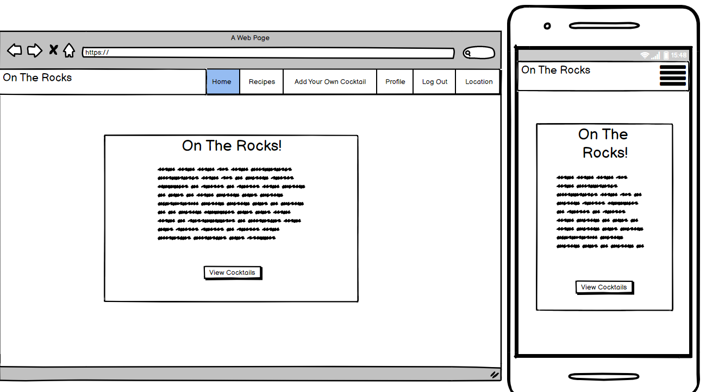
Log In
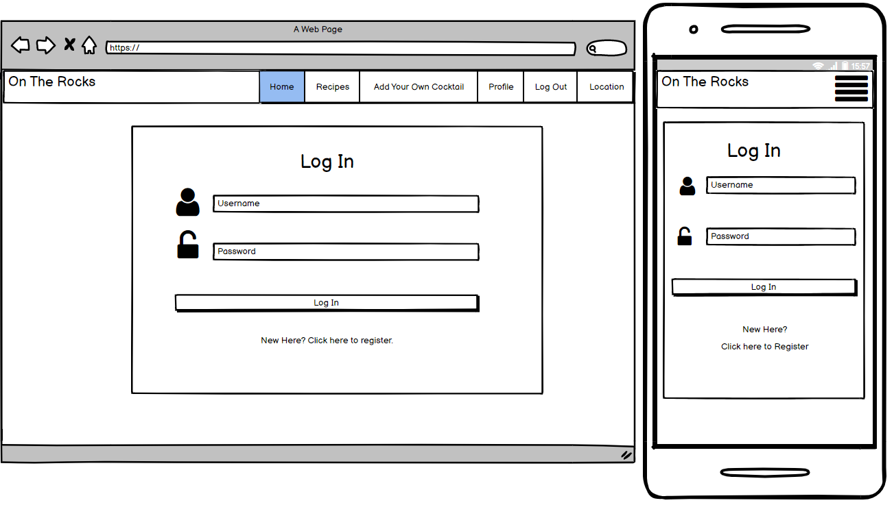
Register
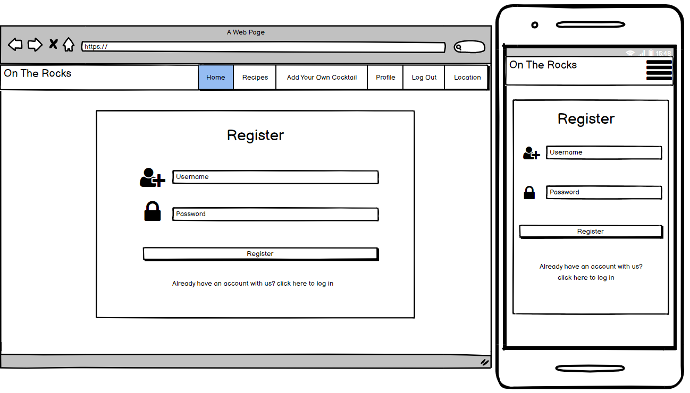
Recipes
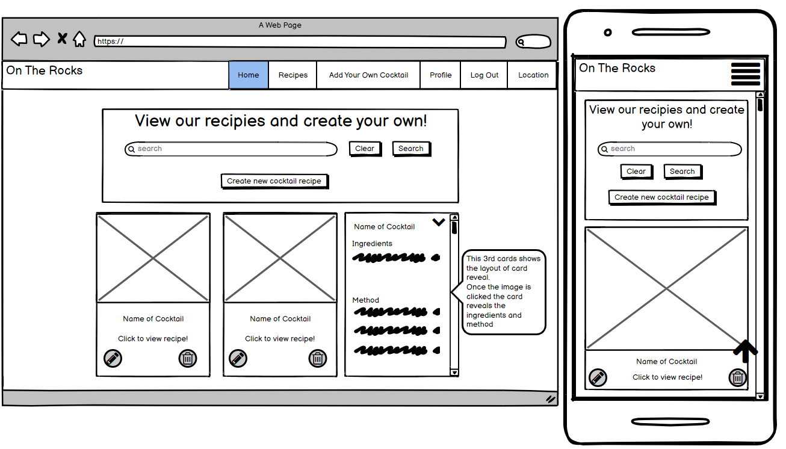
Add Cocktail
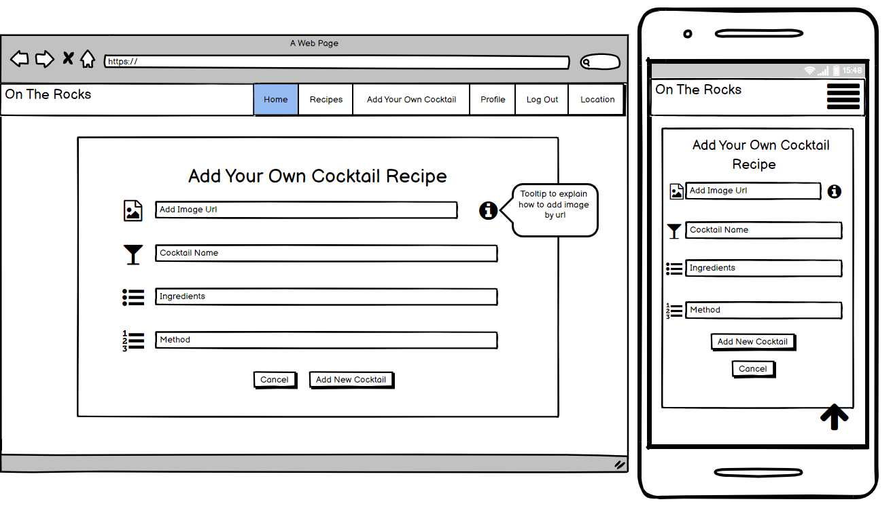
Profile
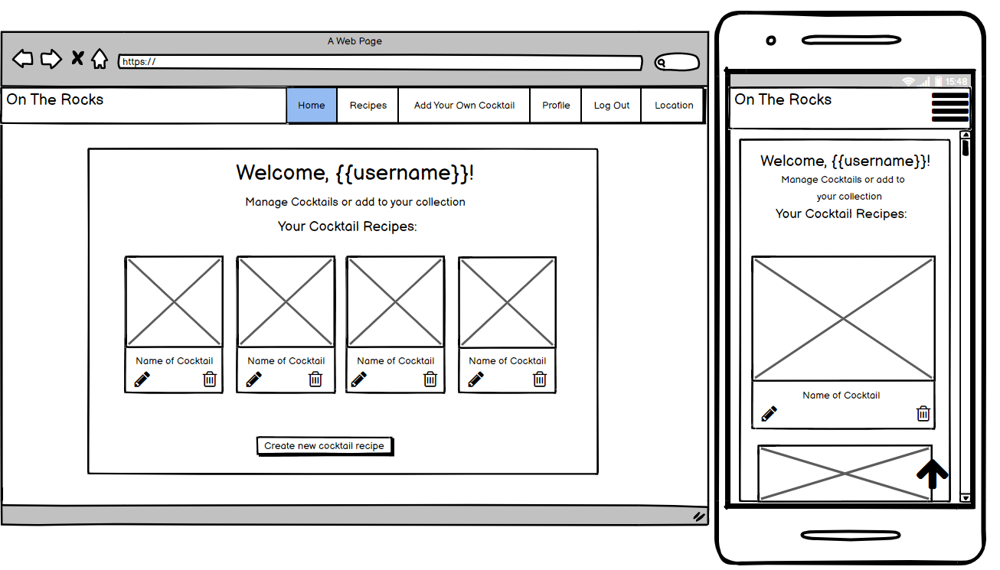
Location
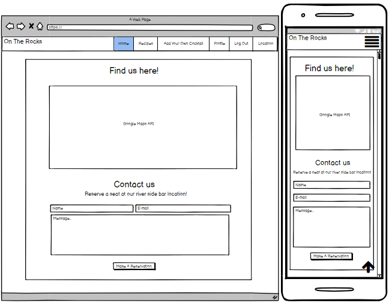

# Design
## Colour Scheme
For my colour scheme, I wanted to keep the background and headers very clean and simple. 

I went for a white brick wall background to keep it clean and fresh while adding a some intrigue and texture.

I kept my navbar as a light grey with white text to contrast. 

All of my page cards are white background with black text to give a modern feel to the site and make sure the
design is not too busy.

This all contrasts well on the recipes and profile page where the colourful images of the cocktails really pop!

## Typography
Throughout the site I used a combination of the two complimentary fonts below found on [Google Fonts](https://fonts.google.com/)

### Monoton 
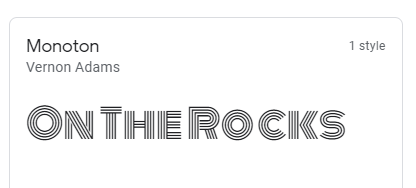

I loved the style of this font, it stands out and adds a bit of drama to the text while
still being legible and easy to read.

Where is it used?

- For the logo in the navbar.
- For all of the headers on each page.

### Roboto Mono

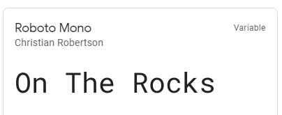

This font is simple but adds a little bit of personality, I feel it compliments the busy Monoton 
font very well.

Where is it used?

- Home page brief overview of sites purpose.
- For the recipe names on the cards.
- All text on the profile page. 
- The headings for the contact form.

## Icons

All icons used throughout the project have been found on [Font Awesome](https://fontawesome.com/)

Icons have been used for the login, register and add cocktail input fields to add extended simplicity
to explain what the user needs to input. 

I have also used icons for a pencil to edit and trash can to delete recipes. 

## Images

The main background image for the site is a white brick wall, this keeps the design clean and simple,
yet adds a industrial edge. 

All other images on the site are the cocktail recipe image URL's added by the users when creating a cocktail.

As a basis to create a good starting point with cocktails on the page ready for people to search and view,
I used recipes and the corresponding images from [BBC Good Food](https://www.bbcgoodfood.com/recipes/collection/easy-cocktail-recipes)

# Features
- Home page displaying the brand logo and information on the sites purpose.
- A link to log in or register for unregistered users.
- A link to view recipes for any existing logged in users.
- User registration functionality.
- Log in / out functionality.
- Recipe page that displays all recipes on the site added by all users.
- Create cocktail page allowing signed in users to create their own cocktail recipes.
- Edit cocktail page allowing signed in users to edit any cocktails they have added.
- Delete cocktail function to allow signed in uers to delete any cocktails they have added.
- Profile page showing any cocktails created by the user with the ability to edit or delete. 
- Location page with API map and form with EmailJS functionality to contact the bar. 
- Mobile responsive design.

## Feature left to impliment
- Admin login will be implemented in the next release to allow admin users to edit or delete recipes added by an user,
this is needed incase there are any recipes added with incorrect or inappropriate information, also to add missing information,
for example if a user added a cocktail without a working image URL link which would effect the overall appearance
of the site. .

# Technologies Used
- HTML
- CSS 
- JavaScript
- Python
- MongoDB
- Github
- Git
- Materialize
- Google fonts
- Chrome developer tools
- Font Awesome
- Heroku
- Figma

# Testing

Responsive Design in Dev Tools Tested responsiveness using google dev tools. I tested the following types:

- iPhone 5/SE (320x568)
- Galaxy S5/Moto G4 (360x640)
- iPhone 6/7/8 (375x667)
- iPhone X (375x812)
- Pixel 2 (411x731)
- Pixel 2 XL (411x823)
- iPhone 6/7/8 Plus (414x736)
- iPad (768x1024)
- iPad Pro 1024x1366)

HTML Validator.

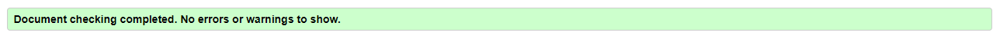

CSS Validator.

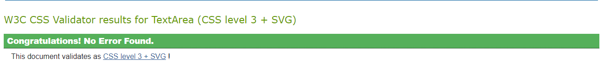

JavaScript  JSHint Validator.

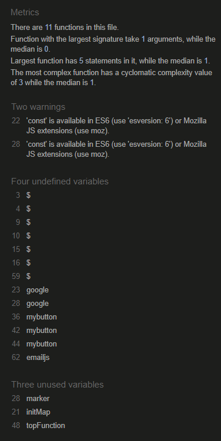

Python  PEP8 Validator.

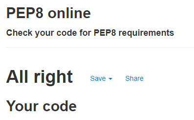

# Known Bugs
Delete Button - deleting random recipes rather than the specific card it relates to - this was picked up via peer review as another student tested
my site to add their own recipes etc and when trying to then remove what they added - it deleted my other recipes.
When i remove the modal to check if you want to delete, the button works fine, altho it is using the same code!

# Deployment
## Project Creation
To create this project I used the CI Gitpod Full Template by navigating [here](https://github.com/Code-Institute-Org/gitpod-full-template) and clicking the 'Use this template' button.

I was then directed to the create new repository from template page and entered in my desired repo name, then clicked Create repository from template button.

Once created, I navigated to my new repository on GitHub and clicked the Gitpod button which built my workspace.

The following commands were used for version control throughout the project:

- git add filename - This command was used to add files to the staging area before committing.

- git commit -m "commit message explaining the updates" - This command was used to to commit changes to the local repository.

- git push - This command is used to push all committed changes to the GitHub repository.

## Deployment to Heroku
Create application:

- Navigate to [Heroku.com](https://dashboard.heroku.com) and login.
- Click on the new button.
- Select create new app.
- Enter the app name.
- Select region.

Set up connection to Github Repository:

- Click the deploy tab and select GitHub - Connect to GitHub.
- A prompt to find a github repository to connect to will then be displayed.
- Enter the repository name for the project and click search.
- Once the repo has been found, click the connect button.

Set environment variables:

Click the settings tab and then click the Reveal Confid Vars button and add the following:

- key: IP, value: 0.0.0.0
- key: PORT, value: 5000
- key: MONGO_DBNAME, value: (database name you want to connect to)
- key: MONGO_URI, value: (mongo uri - This can be found in MongoDB by going to clusters > connect > connect to your application and substituting the password and dbname that you set up in the link).
- key: SECRET_KEY, value: (This is a custom secret key set up for configuration to keep client-side sessions secure).

Enable automatic deployment:

- Click the Deploy tab
- In the Automatic deploys section, choose the branch you want to deploy from then click Enable Automation Deploys.

# Acknowledgments
Scroll to top code found: https://www.w3schools.com/howto/howto_js_scroll_to_top.asp

Pre added receipes found on https://www.bbcgoodfood.com/recipes/collection/cocktail-recipes

Secret key generated from https://randomkeygen.com/

