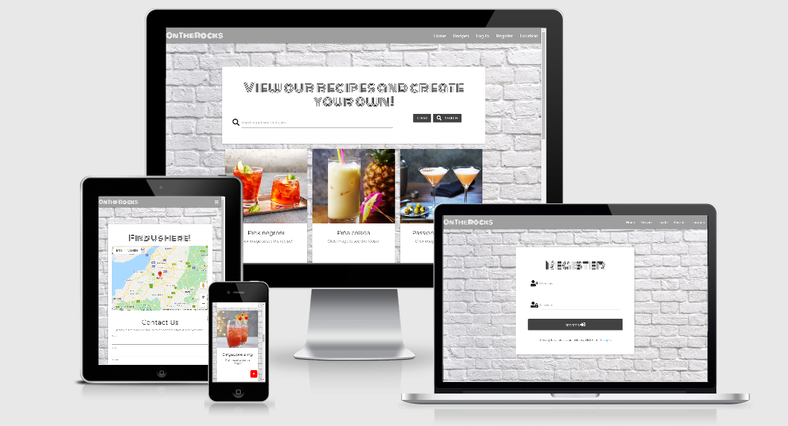
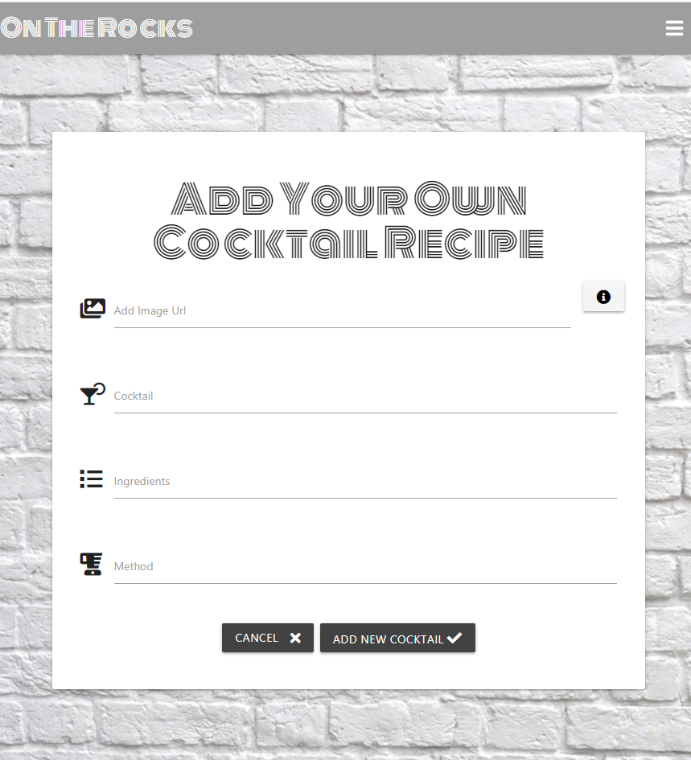
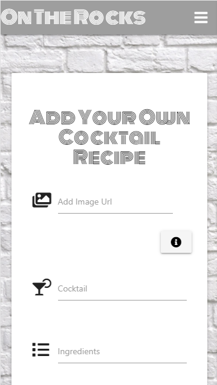

# On The Rocks 

I have created a cocktail recipe site to display my skills in HTML, CSS, JavaScript and Python.

The sites purpose is to display user created recipes that allows anyone to come and search for a specific drink
they would like to know how to make or to search any spirits they have in their house to see what can be made!

My website allows users to interact with the page,they are able to Create, Read, Update and Delete recipes that they have added to the site. 
This displays full CRUD functionailty. 

You can view my deployed site [here](https://on-the-rocks-milestone3.herokuapp.com/home)

You can view my GitHub Repositiory [here](https://github.com/AmyKeedwell/3-Milestone-Project-OnTheRocks)

# UX

As a cocktail lover, there are always new recipes to explore. This site allows users to search for a recipe they 
would love to try, get inspiration by searching their favourite spirit in the search bar and see what new cocktails
they can create with what they have in the house!

A user can:

- view user created cocktails
- read the ingredients needed for each recipe
- read the method used to make each recipe
- see which user created this recipe
- register an account
- log in as an existing user
- log out of their account
- view their profile page including a list of recipes they have added (if any)
- allow users to edit recipes they have added
- allow users to delete recipes they have added
- contact us to make a reservation
- find the location of the bar with the google maps to visit us

## User Stories
1. Anyone looking to expand their knowledge on making cocktails.
2. A user can use this to create their own library of recipes to refer back to.
3. A user seeking inspiration to try something new
4. A user needing to see what ingredients go in a specific cocktail.
5. A user curious of the correct way to make the cocktail.
6. A bar or resturant owner looking to expand their cocktail menu.

First Time Visitor Goals
- Greeted with a simple yet explanitory home page featuring the name of the site and a brief overview of the sites purpose.
- The home screen prompts a user to register. 
- They can **view** recipes already added to the site by other users
- A unregistered user can still view our location and get in contact with us.

Frequent Visitor Goals
- Can easily navigate to the log in page to view their profile and open the CRUD functionality.
- View all cocktails they have added from their profile page, with an option to edit or delete them.
- View all cocktails in the recipes page and again have the option to edit or delete any of their 
user created cocktails
- Log out

Developer Goals
- Demonstrate a solid understanding of MongoDB, Heroku and Python
- Build an inviting, clean and useful cocktail recipe website
- Make the site easy to use and navigate which provides a positive experience
- Build up portfolio

Website Owner Goals
- Have an easy-to-use site that encourages users to interact with it

# Mock Up
Home Page

Log In

Register

Recipes

Add Cocktail

Profile

Location

# Design
## Colour Scheme
For my colour scheme, I wanted to keep the background and headers very clean and simple. 

I went for a white brick wall background to keep it clean and fresh while adding a some intrigue and texture.

I kept my navbar as a light grey with white text to contrast. 

All of my page cards are white background with black text to give a modern feel to the site and make sure the
design is not too busy.

This all contrasts well on the recipes and profile page where the colourful images of the cocktails really pop!

## Typography
Throughout the site I used a combination of the two complimentary fonts below found on [Google Fonts](https://fonts.google.com/)

### Monoton 

I loved the style of this font, it stands out and adds a bit of drama to the text while
still being legible and easy to read.

Where is it used?

- For the logo in the navbar.
- For all of the headers on each page.

### Roboto Mono

This font is simple but adds a little bit of personality, I feel it compliments the busy Monoton 
font very well.

Where is it used?

- Home page brief overview of sites purpose.
- For the recipe names on the cards.
- All text on the profile page. 
- The headings for the contact form.

## Icons

All icons used throughout the project have been found on [Font Awesome](https://fontawesome.com/)

Icons have been used for the login, register and add cocktail input fields to add extended simplicity
to explain what the user needs to input. 

I have also used icons for a pencil to edit and trash can to delete recipes. 

## Images

The main background image for the site is a white brick wall, this keeps the design clean and simple,
yet adds a industrial edge. 

All other images on the site are the cocktail recipe image URL's added by the users when creating a cocktail.

As a basis to create a good starting point with cocktails on the page ready for people to search and view,
I used recipes and the corresponding images from [BBC Good Food](https://www.bbcgoodfood.com/recipes/collection/easy-cocktail-recipes)

# Features
- Home page displaying the brand logo and information on the sites purpose.
- A link to log in or register for unregistered users.
- A link to view recipes for any existing logged in users.
- User registration functionality.
- Log in / out functionality.
- Recipe page that displays all recipes on the site added by all users.
- Create cocktail page allowing signed in users to create their own cocktail recipes.
- Edit cocktail page allowing signed in users to edit any cocktails they have added.
- Delete cocktail function to allow signed in uers to delete any cocktails they have added.
- Profile page showing any cocktails created by the user with the ability to edit or delete. 
- Location page with API map and form with EmailJS functionality to contact the bar. 
- Mobile responsive design.

## Feature left to impliment
- Admin login will be implemented in the next release to allow admin users to edit or delete recipes added by an user,
this is needed incase there are any recipes added with incorrect or inappropriate information, also to add missing information,
for example if a user added a cocktail without a working image URL link which would effect the overall appearance
of the site. .

# Technologies Used
- [HTML](https://developer.mozilla.org/en-US/docs/Web/HTML)
    - HTML for structure.
- [CSS](https://developer.mozilla.org/en-US/docs/Web/CSS) 
    - CSS for Styling.
- [JavaScript](https://www.javascript.com/)
    - To add google maps API and scroll button
- [JQuery](https://jquery.com/)
    - To add functionality to materialize compontents
- [Python](https://www.python.org/)
    - Back end progamming language.
- [DNS Python](https://pypi.org/project/dnspython/)
    - DNS Tool kit
- [Its Dangerous](https://itsdangerous.palletsprojects.com/en/1.1.x/)
    - Sends data to untrusted environments safely.
- [Click](https://pypi.org/project/click/)
    - Command line creation kit.
- [Flask](https://flask.palletsprojects.com/en/1.1.x/)
    -  A WSGI micro framework.
- [Flask PyMongo](https://flask-pymongo.readthedocs.io/en/latest/)
    - MongoDB support for Flask applications.
- [Werkzeug](https://pypi.org/project/Werkzeug/)
    - To generate password hash and to check password hash.
- [PyMongo](https://pymongo.readthedocs.io/en/stable/)
    - MongoDB support for Flask applications.
- [MongoDB](https://www.mongodb.com/3)
    - to create my users and recipes database
- [Github](https://github.com/)
    - Repository hosted on GitHub
- [Git](https://git-scm.com/)
    - Git used for Version Control.
- [Materialize](https://materializecss.com/)
    - Responsive front-end framework 
- [Google Fonts](https://fonts.google.com/)
    - for typography
- [Chrome developer tools](https://www.google.com/chrome/)
    - used to view and test site throughout creation
- [Font Awesome](https://fontawesome.com/)
    - Used to add icons throughout the page.
- [Heroku](https://dashboard.heroku.com)
    - To deploy my website
- [Balsamiq Wireframes](https://balsamiq.com/)
    - Used to create a wireframe design

# Testing

### Navbar
The navbar as been created with the help of materialize, it sticks to the top of the page and has the sidenav functionality to switch
to a hamburger icon with a right hand sidenav bar on smaller screens. This has been tested and and works correctly on all screen sizes.

The options on the navbar will change depending on if a user is logged in or not, see below: 

#### As a new user
Will have the following options on the navbar
- Home
- Recipes
- Log In
- Register
- Location 

#### As an exising user (logged in)
Will have the following options on the navbar
- Home
- Recipes
- Add Your Own Cocktail
- Profile
- Log out
- Location

---

### Home page

#### As a new user 
Tested all of the options available to a new unregistered user. The home page displays the logo with a breif description of the site, below there are 
buttons as prompts for the user to either Register as a new user or to Log in as an existing user. The Log In button sucessfully navigates the user to the 
log in page an the register button sucessfully navigates to the register page. The Navbar options available to a unregistered user are Home, Recipes, 
Log In, Register and Location.

#### As an exising user (logged in)
Testing all of the options available to a logged in user. The home page displays the logo with a breif description of the site, below there are
button 

---

### Recipes page

#### As a new user
Tested the functionailty for an unregistered user, when they navigate to the Recipes page they will see a page full of user created cocktail recipes
and they have able to view only. They can click on any of the cocktail images to view the ingredients,methods required to make them and who the recipe 
was created by via card reveal functionaility. They cannot make any amendments and do not have the option to add any of their own recipes. 

#### As an exising user (logged in)
When a resgistered user navigates to the recipes page, they will also see a page full of user created cocktail recipes. They will be able to view-only 
any recipes added by other users but on any recipes they have added, they will see buttons on the recipe card allowing them to their edit or delete 
that recipe. When a user clicks on the green pencil edit button, they are redirected to the edit cocktail page. All of the information fields will be 
auto filled with that recipe's information and the user can make any nessecary changes. They have the option to confirm these changes by clicking the 
edit cocktail button which will save the changes and redirect them back to the recipes page, or click cancel which will redirect them back to the recipes page

****FOUND ISSUE WHEN EDITING THAT IMAGE URL NO LONGER WORKS****

---

### Add a cocktail page (ONLY AVAILABLE TO REGISTERED USERS)
Add your own cocktail recipes, registered users have the opportunity to contribute to the websites database and add their own creations!
They have four required fields to fill out in order to add a recipe, first is the image url, I have added a tooltip next to this field as
may need a little more explination, ideally in future versions I would like to change this to an option to browse computer and upload a file. 
Next they need to enter the name of their cocktail, the ingredients needed and the method to make it. All of these fields are required and 
the cocktail cannot be created with any missing fields. 

---

### Profile page (ONLY AVAILABLE TO REGISTERED USERS)
Every registered user will have a personalised profile page, once navigated to each user will have a personalised welcome message 'Welcome {{Username}}' followed
by 'Manage Cocktails or add to your collection!'. Below this, if the user has already contributed by adding cocktail recipes to the site, all of their creations
will be shown on their profile page. This section does not show the full recipe from the profile page but does allow the functionaility for the user to either edit 
or delete their own cocktails. Also the option at the bottom of the page to create another recipe, they will be directed back to the Add A Cocktail Page when this
is clicked. 

---

### Register page (ONLY AVAILABLE TO UN-REGISTERED USERS)

If a new user wants to join in and create their own profile, they can sucessfully navigate to the registration page from the Home screen or the the navbar.
They will be promted to create their own personal username and password and click on the resgister button. Once they have sucessfully registered they will be
redirected to their newly created profile page which will display a flash message confirming a sucessful registeration and a personalised homepage for that specific user, 
welcoming them by their new username. 

Below this form there is some text stating 'Already have an account with us, click here to Log In' a user can click the link to log in if they have already registered. 

---

### Login page (ONLY AVAILABLE TO UN-REGISTERED USERS)

If a new user clicks on the log in button, they will be unable to log in with any username and password that has not been created on the resgister page.
They will see a link below the log in form feilds stating 'New Here, Register' they can click on register to be redirected to the resgistration page. 

---

### Location page

The location page is the only page that does not differ for registered and unregisted users. They will see a google maps API with a marker to a fake 
location for the bar, gesture handling has been put in place so users can only navigate the map while holding ctrl to ensure the page scrolls consistantly.
Below this they will find a form to contact us in order to make a reservation. This form has been created with emailJS. If the user tries to click to make 
a reservation before filling out the form, nothing will send but they will get a pop up asking them to fill in the required fields. Once a user has filled in 
all of the required fields, their email will be sucessfully sent and they will see a pop up 'Thank you for booking a reservation with us, we will be in touch
to confirm your booking and look forward to seeing you!' once closed the page will reload and clear/refresh the form. 

---

## Peer Code review

I posted my deployed project and github repo to slack for peer code review and overall had positive feedback with compliments on the UX design of the site.  

There were a few helpful errors flagged:

- Flagged that my resgister button didnt have a name attribute so added this.
- The positioning of the tooltip on the Add Your Own Cocktail page wasnt sitting correctly on smaller screens. I tried to fix this
by changing the width of the Image Url bar on smaller screens, got it slightly better but not 100%, there is not enough space for the
tooltip to sit next to the Image Url bar on smaller screens and for it to still be functional. May not be the best UX but it has the best
functionality this way!
 

## Responsiveness

Responsive Design in Dev Tools Tested responsiveness using google dev tools. I tested the following types:

- iPhone 5/SE (320x568)
- Galaxy S5/Moto G4 (360x640)
- iPhone 6/7/8 (375x667)
- iPhone X (375x812)
- Pixel 2 (411x731)
- Pixel 2 XL (411x823)
- iPhone 6/7/8 Plus (414x736)
- iPad (768x1024)
- iPad Pro 1024x1366)

### HTML Validator.

### CSS Validator.

### JavaScript  JSHint Validator.

#### Remaining Warnings 

There are some issues flagged with some variables within my JS, these variables such as google for example
are coming from an Google Maps API and that needs this code to run.

### Python PEP8 Validator.

# Known Bugs
Delete Button - deleting random recipes rather than the specific card it relates to - this was picked up via peer review as another student tested
my site to add their own recipes etc and when trying to then remove what they added - it deleted my other recipes.
When i remove the modal to check if you want to delete, the button works fine, altho it is using the same code!

# Deployment
## Project Creation
To create this project I used the CI Gitpod Full Template by navigating [here](https://github.com/Code-Institute-Org/gitpod-full-template) and clicking the 'Use this template' button.

I was then directed to the create new repository from template page and entered in my desired repo name, then clicked Create repository from template button.

Once created, I navigated to my new repository on GitHub and clicked the Gitpod button which built my workspace.

The following commands were used for version control throughout the project:

- git add filename - This command was used to add files to the staging area before committing.

- git commit -m "commit message explaining the updates" - This command was used to to commit changes to the local repository.

- git push - This command is used to push all committed changes to the GitHub repository.

## Deployment to Heroku
Create application:

- Navigate to [Heroku.com](https://dashboard.heroku.com) and login.
- Click on the new button.
- Select create new app.
- Enter the app name.
- Select region.

Set up connection to Github Repository:

- Click the deploy tab and select GitHub - Connect to GitHub.
- A prompt to find a github repository to connect to will then be displayed.
- Enter the repository name for the project and click search.
- Once the repo has been found, click the connect button.

Set environment variables:

Click the settings tab and then click the Reveal Confid Vars button and add the following:

- key: IP, value: 0.0.0.0
- key: PORT, value: 5000
- key: MONGO_DBNAME, value: (database name you want to connect to)
- key: MONGO_URI, value: (mongo uri - This can be found in MongoDB by going to clusters > connect > connect to your application and substituting the password and dbname that you set up in the link).
- key: SECRET_KEY, value: (This is a custom secret key set up for configuration to keep client-side sessions secure).

Enable automatic deployment:

- Click the Deploy tab
- In the Automatic deploys section, choose the branch you want to deploy from then click Enable Automation Deploys.

# Acknowledgments
Scroll to top code found: https://www.w3schools.com/howto/howto_js_scroll_to_top.asp

Pre added receipes found on https://www.bbcgoodfood.com/recipes/collection/cocktail-recipes

Secret key generated from https://randomkeygen.com/

